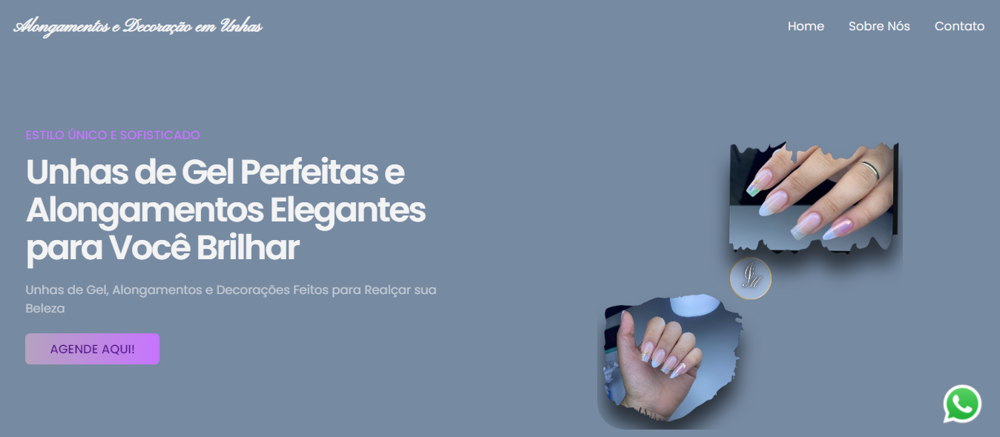

# Projeto: Site para Cliente de Unhas de Fibra

## Descrição do Projeto

Este é um projeto desenvolvido para uma cliente especializada em unhas de fibra e alongamentos. O objetivo foi criar um site moderno, responsivo e alinhado com a identidade visual da marca, garantindo uma experiência única e sofisticada para seus clientes.

### Principais Características
+ Design Personalizado: Criado com base na identidade visual da marca, incluindo paleta de cores, tipografia e logotipo.
+ Animações Dinâmicas: Efeitos visuais que melhoram a experiência do usuário, como transições e contagens animadas.
+ Responsividade: Layout adaptável para diferentes dispositivos (desktop, tablet e mobile).
+ Chamada para Ação: Botões interativos que levam os usuários ao WhatsApp para agendamentos rápidos.

## Tecnologias Utilizadas
<table>
  <tr>
            <th>Ferramenta</th>
            <th>Descrição</th>
          
  </tr>
 <tbody>
      <tr>
            <td>HTML5</td>
            <td>	Estrutura semântica do site.</td>
           
   </tr>
        <tr>
            <td>CSS3</td>
            <td>Estilização avançada com animações e responsividade.</td>
      </tr>
        <tr>
            <td>JavaScript</td>
            <td>Adicionado para funcionalidades dinâmicas e animações.</td>
           
  </tr>
  <tr>

  <td>Git/GitHub</td>
    <td>Controle de versão e hospedagem do código.</td>
    
  </tr>
    </tbody>
  
</table>

## Funcionalidades Implementadas
<ol>
  <li>Animações com JavaScript:  </li>
  <ul> <li>Contagem numérica que inicia quando o usuário visualiza os elementos na tela. </li> </ul>
   <ul> <li>Transições suaves ao interagir com botões. </li> </ul>
   
  <li>Design Focado na Marca:</li>
  <ul> <li> Utilização das cores e elementos gráficos da identidade visual da cliente.</li> </ul>
   
  <li>Agendamento Fácil:</li>
  <ul> <li>  Botão direto para o WhatsApp para facilitar a comunicação entre cliente e salão.</li> </ul>
    <li>Acessibilidade e Usabilidade:</li>
    <ul> <li>Texto otimizado para legibilidade e navegação intuitiva. </li> </ul>
</ol>

# Como Executar o Projeto
<ol>
  <li> Clone o repositório: </li>
  git clone <href>https://github.com/Digo-Nery/BellynalDesgner.git</href> 
   <li> Navegue até a pasta do projeto: </li>
   <href> cd BellynalDesgner</href>

</ol>

# Capturas de Tela

<video width="320" height="240" controls="controls" autoplay="autoplay">
<source src="Yes Bank Advertisment.mp4" type="video/mp4">
<object data="" width="320" height="240">
<embed width="320" height="240" src="Yes Bank Advertisment.mp4">
</object>
</video>
# Contribuição
Contribuições são bem-vindas! Sinta-se à vontade para abrir issues ou enviar um pull request.
### Contato
Caso tenha dúvidas ou queira contratar meus serviços:

+ E-mail: rneribastos@hotmail.com
+ LinkedIn:<button   class="section--descubra"> <a href="https://www.linkedin.com/in/rodrigo-neri-bastos-064859285/">Meu perfil </a></button>
+ WhatsApp: <button   class="section--descubra"> <a href="https://w.app/ajQOKM">Me chame aqui!</a></button>
